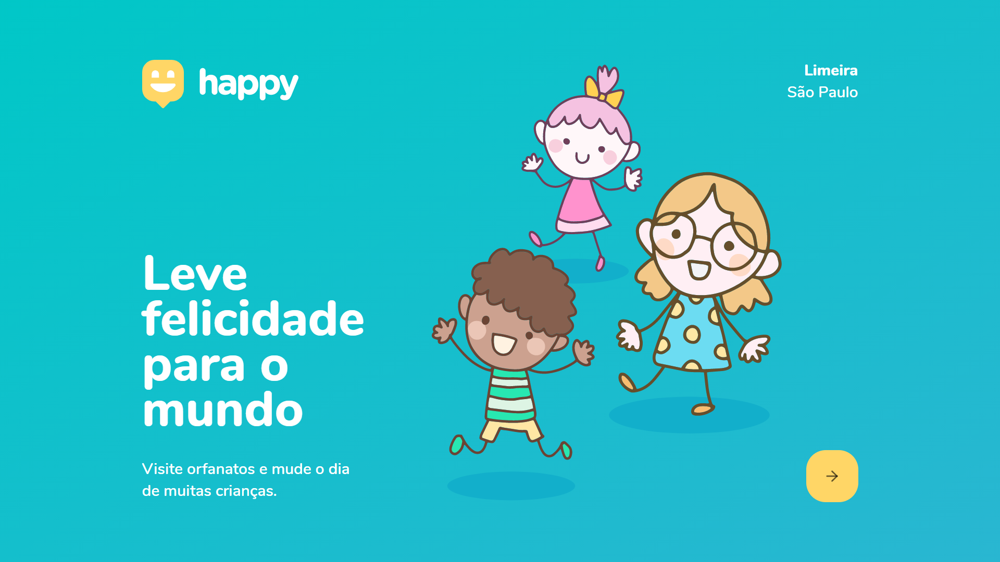
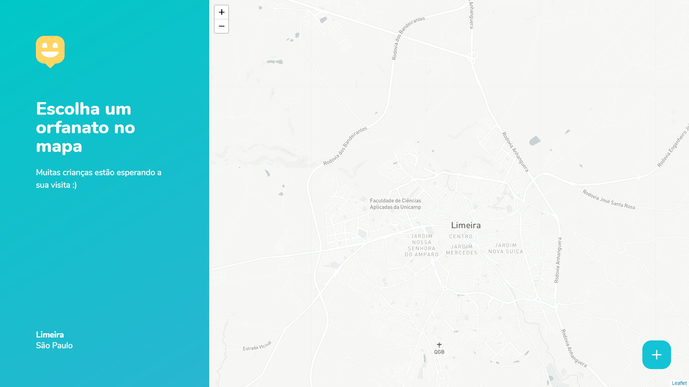

📜 Project for studies following "Next Level Week 3".

💡 The project registers orphanages and shows on the map so that people can schedule visits and play with the children.


## 🖼️ Screenshots





## 💻 Get started

### Backend

```sh
yarn install
yarn typeorm migrations:run
yarn dev
```

### Web

```sh
yarn install
yarn start
```

## 📝 Changelog

- 1.0.0

  - mobile

- 0.0.3

  - frontend
  - backenf fixes
  - Work in Progress

- 0.0.2

  - backend
  - Work in Progress

- 0.0.1
  - landing page
  - Work in Progress

## 🏆 Credits

Diego Fernandes – [@dieegosf](https://twitter.com/dieegosf)

Rocketseat - [@rocketseat](https://twitter.com/rocketseat)
